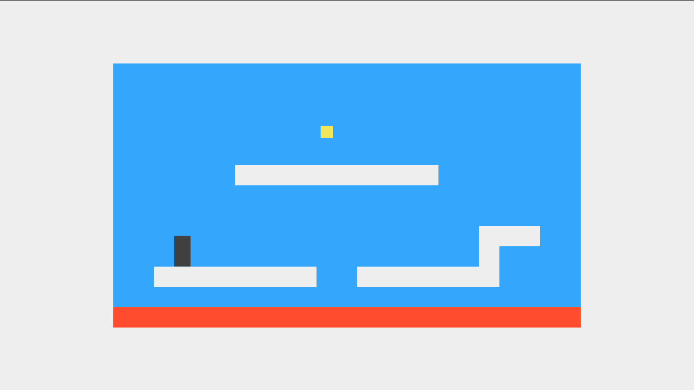
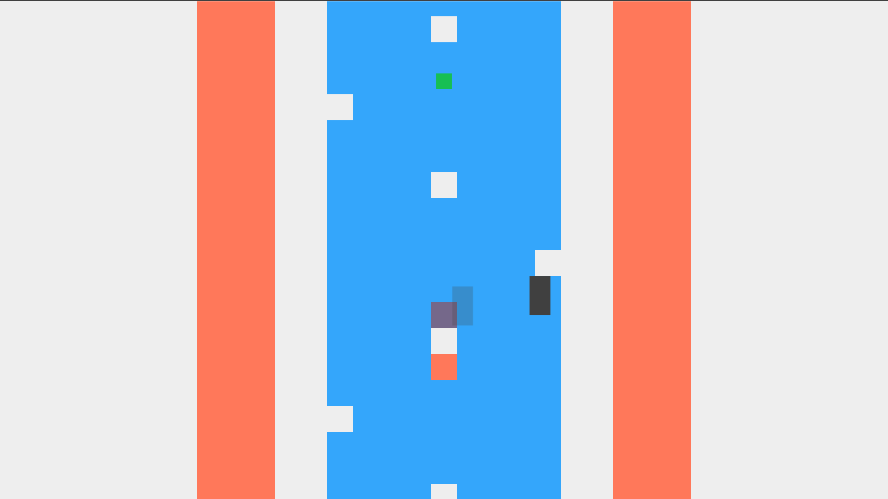

# Simple platformer

## Запуск
### Локально
* Клонируйте репозиторий
* Откройте `index.html` с помощью браузера
### Онлайн
https://c0smocat.github.io/platformer/
### Управление
`W` `A` `S` `D` / `стрелки` для движения
## Фичи
* Гравитацию можно менять
* Несколько уровней
* Поддержка сенсорного управления
* Простое создание уровней (см. `index.html` через редактор)
* ES6
* Размер игры подстраивается под экран